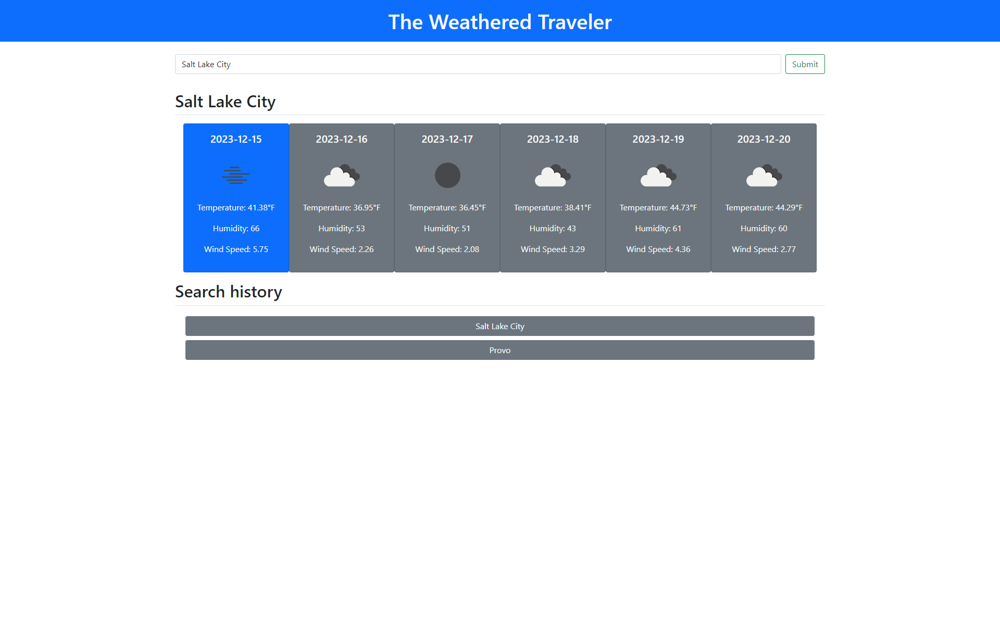

# The Weathered Traveler
## Description

The Weathered Traveler is a simple weather app that allows users to search for and see current and forecasted weather conditions. Users can search for weather conditions by city name. Each user will have their personal search history saved into local storage to enable them rapid access to recent search results. This project is powered by the OpenWeather API.

This project was created to utilyze and develop a deeper understanding of how to effectively implement server-side APIs into web-based applications. Working with the OpenWeather API was very intuitive, and is accompanied by very clear documentation. The only issue that I ran into early on was attempting to call results using latitude and longitude rather than by city name. After making that switch, the API results began working consistently.

This was also the first project that I created fully utilyzing a CSS library. This project helped me to understand Bootstrap more in-depth, as I fully relied on its implementation for styling.

## Usage

This project is live and can be accessed at the following link: https://honeybuzz94.github.io/the-weathered-traveler/

Anyone is welcome to use or duplicate this project as they would like.

## Credits

Collaborators:

* There were no collaborators for this project.

The following resources were used to assist with the development of this project:

* [OpenWeather API](https://openweathermap.org/)
* [jQuery](https://jquery.com/)
* [Bootstrap](https://getbootstrap.com/)
* [Day.js](https://day.js.org/)
* [w3schools](https://www.w3schools.com)

---